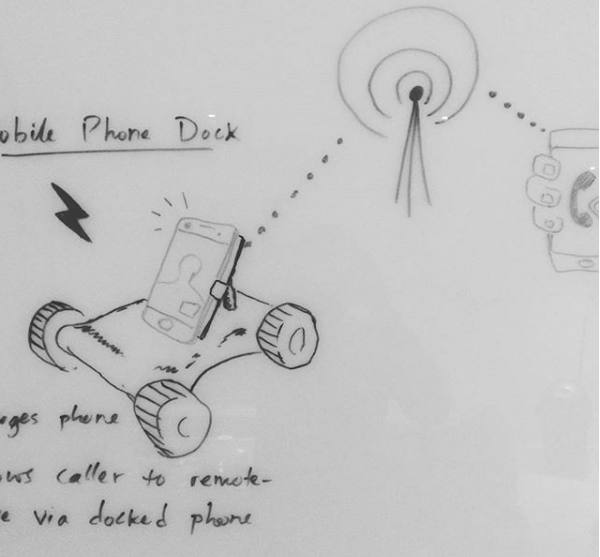

# Robo Dock
* Mobile phone dock on wheels
* Caller can drive the platform around your house using live video feed from your front-facing cameras
..

###Get Started - Required Items
1. Raspberry Pi 2 [£32.99 on Amazon](https://www.amazon.co.uk/Raspberry-Pi-Model-Desktop-Linux/dp/B00T2U7R7I/ref=sr_1_2?ie=UTF8&qid=1519598624&sr=8-2&keywords=raspberry+pi+2&dpID=4133JwedpXL&preST=_SX300_QL70_&dpSrc=srch)
2. Remote controlled car [£9.99 on Maplin](https://www.maplin.co.uk/p/lamborghini-huracan-124-rc-car-n05eg)
3. Controller for front and back motors [£4.83 on Amazon](https://www.amazon.co.uk/gp/product/B01KBTNHS6/ref=oh_aui_detailpage_o03_s02?ie=UTF8&psc=1)
4. Sugru Mouldable Glue -  [£6.11 on Amazon](https://www.amazon.co.uk/Sugru-Mouldable-Glue-Original-Formula/dp/B01BFE0KNQ/ref=sr_1_1?s=diy&ie=UTF8&qid=1519599266&sr=1-1&keywords=sugru&dpID=41zqrfcSSwL&preST=_SY300_QL70_&dpSrc=srch)
5. 1 Metal-wire hanger (used for constructing the phone rigging)
6. 1 transparent phone pouch (any should do)

Note: You'll also be needing standard DIY tools like pliers and screw drivers so make sure you have those handy!

###Get Started - Assembly
 *Coming Soon!*
